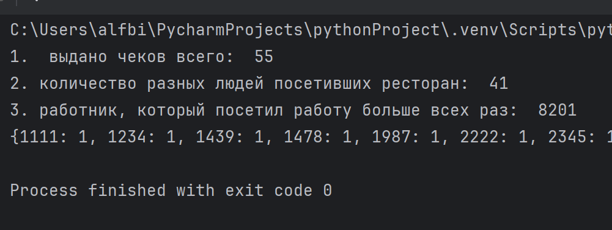
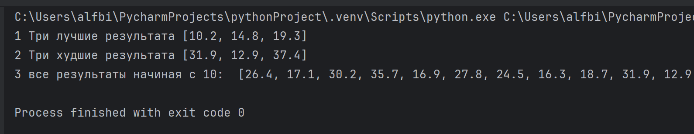
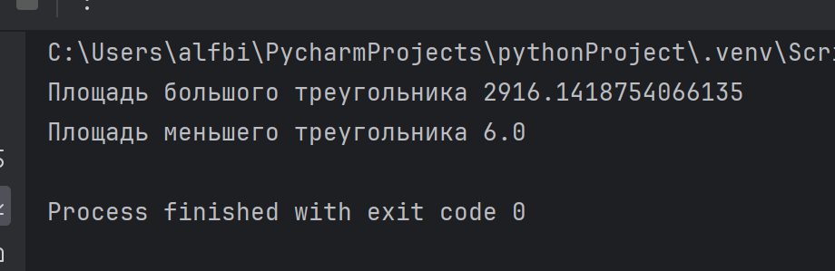
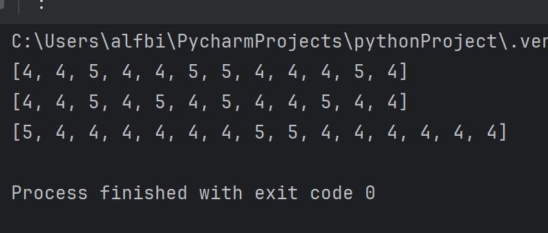
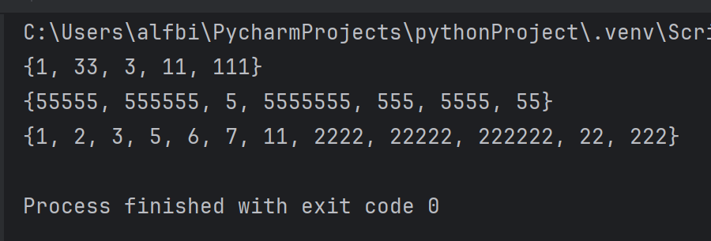

# software-ingineering

Отчет по Теме #5 выполнил(а):

Бидаев Альфред Александрович
- ПИЭ-21-1


| Задание | Лаб_раб | Сам_раб |
| ------ | ------ |---|
| Задание 1 | + | + |
| Задание 2 | + | + |
| Задание 3 | + | + |
| Задание 4 | + | + |
| Задание 5 | + | + |
| Задание 6 | + | 
| Задание 7 | + | 
| Задание 8 | + | 
| Задание 9 | + | 
| Задание 10 | + | 

# Лабораторная работа # 1

### Друзья предложили вам поиграть в игру "найди отличия и убери повторения (версия для программистов)". Суть игры состоит в том, что на вход программы поступает два множества, а ваша задача вывести все элементы первого, которых нет во втором. А вы как раз недавно прошли множества и знаете их возможности, поэтому это не составит для вас труда

```python
set_1 = {'white', 'black', 'red', 'pink'}
set_2 = {'red', 'green', 'blue', 'red'}

print('1', set_1 - set_2)

set_1 = {'white', 'black', 'red', 'pink', 'black', 'white'}
set_2 = {'red', 'green', 'blue', 'red'}

print('2', set_1 - set_2)

set_1 = {'white', 'black', 'red', 'pink', 'red', 'red'}
set_2 = {'red', 'green', 'red', 'red', 'red'}

print('3', set_1 - set_2)

```
### Результат:


# Лабораторная работа №2

### Напишите две одинаковые программы, только одна будет использовать set(), а вторая frozenset() и попробуйте к исходному множеству добавить несколько элементов, например, через цикл.

```python
a = set('abcdefg')
print(a)
for i in range(1,5):
    a.add(i)
print(a)
```

### Результат:


```python
a = frozenset('abcdefg')
print(a)
for i in range(1,5):
    a.add(i)
print(i)
```

### Результат:


# Лабораторная работа №3

### На вход в программу поступает список (минимальный длиной 2 символа). Напиишите программу, которая будет менять первый и последний элемент списка. PS в python есть прикольное свойство, благодаря которому эту задачу можно решить более красиво, использовав всего две строчки кода, если интересно можете сами найти это решение

```python
def replace(input_list):
    memory = input_list[0]
    input_list[0] = input_list[-1]
    input_list[-1] = memory

    return input_list

print(replace([1, 2, 3, 4, 5, 6]))
```

### Результат:


# Лабораторная работа №4

### На вход в программу поступает список (минимальный длиной 10 символов). Напишите программу, которая выводит элементы с индексами от 2 до 6. В программе необходимо использовать "срез".

```python
a = [12, 54, 32, 57, 843, 2346, 765, 75, 25, 234, 756, 23]
print(a[2:6])
```

### Результат:


# Лабораторная работа №5

### Иван задумался о поиске "бесполезного" числа, полученного из списка. Суть поиска в следующем: он берет произвольный список чисел, находит самое большое из них, а затем делит его на длину списка. Студент пока не придумал, где может пригодиться подобное значение, но ищет у вас помощи в реализации такой функции useless()
```python
def useless(lst):
    return max(lst) / len(lst)

print(useless([3, 5, 7, 3, 33]))
print(useless([-12.5, 54, 77.3, 0, -36, 98.2, -63, 21.7, 47, -89.6]))
print(useless([-25.8, 86, 12.5, -56, 73.2, 0, 43, -91.5, 65.9, -7]))
```

### Результат:


# Лабораторная работа №6

### Ребята не могут определиться каким супергероем они хотят стать. У них есть случайно составленный список супергероев, и вы должны определить кто из ребят будет каким супергероем. Необходимо использовать разделение списков

```python
superheroes = ['superman', 'spiderman', 'batman']

nikolay, vasily, ivan = superheroes

print('Николай - ',nikolay)
print('Василий - ',vasily)
print('Иван - ',ivan)
```

### Результат:


# Лабораторная работа №7

### Вовочка, насмотревшись передачи "слабое звено" решил написать программу, которая также будет находить самое слабое звено (минимальный элемент) и удалять его, только делать он это хочет не с людьми, а со списком. Помогите Вовочке с реализацией программы. Подсказка: для этого вам необходимо отсортировать список и удалить значение при помощи pop()

```python
a = [-25.8, 86, 12.5, -56, 73.2, 0, 43, -91.5, 65.9, -7]
a.sort()
print('Отсортированный список: \n', a)
a.pop(0)
print('Отсортированный список без наименьшего элемента : \n', a)
```

### Результат:


# Лабораторная работа №8

### Михаил решил создать большой n-мерный список, для этого он случайным образом создал несколько списков, состоящих минимум их 3, а максимум из 10 элементов и поместил их в один большой список. Он также как и Иван не знает зачем ему это сейчас нужно, но надеется на то, что это пригодится ему в будущем.

```python
from random import randint

def list_maker():
    a = [randint(1, 100)] * randint(3, 10)
    return a

if __name__ == '__main__':
    result = []
    for i in range(randint(1,5)):
        result.append(list_maker())

        print(result)
```

### Результат:


# Лабораторная работа №9

### Вы работаете в ресторане и отвечает за стилистику покупок, ваша задача сравнить между собой заказы покупателей, которые указаны в разном порядке. Реализуйте функцию superset(), которая принимает 2 множества. Результат работы функции: вывод в консоль одного из сообщений в зависимости от ситуации:

```python
def superset(set_1, set_2):
    if set_1 > set_2:
        print(f'Объект {set_1} является чистым супермножеством')
    elif set_1 == set_2:
        print(f'Множества равны')
    elif set_1 < set_2:
        print(f'объект {set_2} является чистым супермножеством')
    else:
        print('супермножество не обнаружено')

if __name__ == '__main__':
    superset({1, 8 , 3, 5}, {3, 5})
    superset({1, 8 ,3, 5}, {5, 3, 8, 1})
    superset({3, 5}, {5, 3, 8, 1})
    superset({90, 100}, {3, 5})
```

### Результат:


# Лабораторная работа №10

### Предположим, что вам нужно разобрать стопку бумаг, но нужно начать работу с нижней, "переверните стопку". Вам дан произвольный список. Представьте его в обратном порядке. Программа должна занимать не более двух строк в редакторе кода.

```python
my_list = [2, 5, 8, 3]
print(my_list[::-1])
```

### Результат:


# Самостоятельная работа # 1

### Ресторан на предприятии ведет учет посещений за неделю при помощи кода работника. У них есть список со всеми посещениями за неделю. Ваша задача посчитать:
* сколько было выдано чеков
* сколько разных людей посетило ресторан
* Какой работник посетил ресторан больше всех раз
```python
check = [8734, 2345, 8201, 6621, 9999, 1234, 5678, 8201, 8888, 4321, 3365,
         1478, 9865, 5555, 7777, 9998, 1111, 2222, 3333, 4444, 5556, 6666,
         5410, 7778, 8889, 4445, 1439, 9604, 8201, 3365, 7502, 3016, 4928,
         5837, 8201, 2643, 5071, 9682, 8530, 3250, 7193, 9051, 4506, 1987,
         3365, 5410, 7168, 7777, 9865, 5678, 8201, 4445, 3016, 4506, 4506]

print('1.', ' выдано чеков всего: ', len(check))

print('2.', 'количество разных людей посетивших ресторан: ', len(set(check)))

check = sorted(check)

count_max = {}

for num in check:
    if num in count_max:
        count_max[num] += 1
    else:
        count_max[num] = 1


print('3.', 'работник, который посетил работу больше всех раз: ', max(count_max, key=count_max.get))

print(count_max)
```

### Результат: 


### Вывод


# Самостоятельная работа # 2

### На физкультуре студенты сдавали бег, у преподавателя физкультуры есть список всех результатов, ему нужно узнать
* три лучшие результата
* три худшие результата
* все результаты начиная с 10

```python
results = [10.2, 14.8, 19.3, 22.7, 12.5, 33.1, 38.9, 21.6, 26.4, 26.4, 17.1, 30.2, 35.7, 16.9, 27.8, 24.5, 16.3, 18.7, 31.9, 12.9, 37.4]

results = sorted(results)
print(results)

print('1', 'Три лучшие результата', results[0:3])
print('2', 'Три худшие результата', results[-3::])
print('3', 'все результаты начиная с 10: ', results[9::])
```

### Результат: 


### Вывод

# Самостоятельная работа # 3

### преподаватель по математике придумал странную задачку. У вас есть три списка с элементами, каждый из которых - длина стороны треугольника, ваша задача найти площади двух треугольников, составленные из максимальных и минимальных элементов полученных списков. Результатом выполнения задачи будет: листинг кода и вывод в консоль, в котором будут эти два значения

```python
import math

one = [12, 25, 3, 48, 71]
two = [5, 18, 40, 62, 98]
three = [4, 21, 37, 56, 84]

def triangle_area(a, b, c):
    s = (a + b + c) / 2

    area = math.sqrt(s * (s - a) * (s - b) * (s - c))
    return area

print('Площадь большого треугольника', triangle_area(max(one), max(two), max(three)))
print('Площадь меньшего треугольника', triangle_area(min(one), min(two), min(three)))
```

### Результат: 


### Вывод

# Самостоятельная работа # 4

### Никто не любит получать плохие оценки, пэотому Борис решил это исправить. Допустим, что все оценки студента за семестр хранятся в одном списке. Ваша задача удалить из этого списка все двойки, а все тройки заменить на четверки.

```python
def remove2_and_replace3(marks):
    i = 0
    while i < len(marks):
        if marks[i] == 2:
            del marks[i]
        elif marks[i] == 3:
            marks[i] = 4
            i += 1
        else:
            i += 1
    return marks

mark_1 = [2, 3, 4, 5, 3, 4, 5, 2, 2, 5, 3, 4, 3, 5, 4]
mark_2 = [4, 2, 3, 5, 3, 5, 4, 2, 2, 5, 4, 3, 5, 3, 4]
mark_3 = [5, 4, 3, 3, 4, 3, 3, 5, 5, 3, 3, 3, 3, 4, 4]

print(remove2_and_replace3(mark_1))
print(remove2_and_replace3(mark_2))
print(remove2_and_replace3(mark_3))
```

### Результат: 


### Вывод

# Самостоятельная работа # 5

### Вам предоставлены списки натуральных чисел, из них необходимо сформировать множества. При этом следует соблюдать это правило: Если какое-либо число повторяется, то преобразовать его в строку по следующему образцу: например, если число 4 повторяется 3 раза, то в множестве будет следующая заись: само число 4 строка 44, строка 444

```python
def transform_to_sets(lst):
    counts = {}
    result = set()

    for num in lst:
        counts[num] = counts.get(num, 0) + 1

    for num, count in counts.items():
        for i in range(1, count + 1):
            result.add(int(str(num) * i))

    return result

list_1 = [1, 1, 3, 3, 1]
list_2 = [5, 5, 5, 5, 5, 5, 5]
list_3 = [2, 2, 1, 2, 2, 5, 6, 7, 1, 3, 2, 2]

print(transform_to_sets(list_1))
print(transform_to_sets(list_2))
print(transform_to_sets(list_3))
```

### Результат: 


### Вывод
